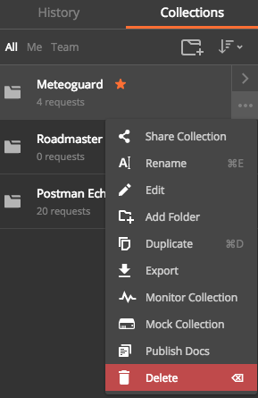
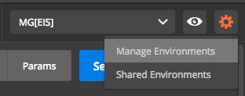
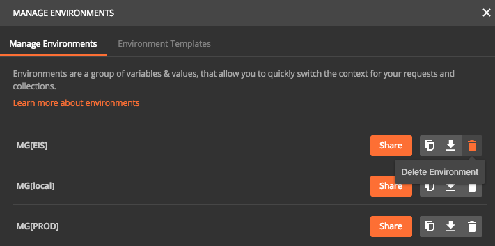
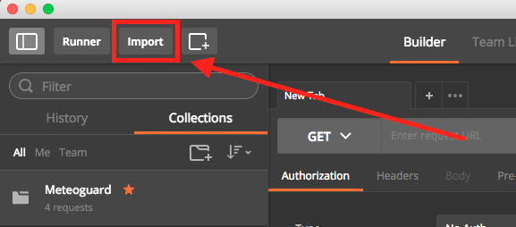

# Shared Postman config for Transport team
Importable configs for Postman: request collections per app (Roadmaster, MeteoGuard 2.0, etc.), environmental variables

## Installation
1. Open Postman
2. Remove previous versions of collections and environments to avoid copies creation:
   - To remove collections hit '...' and then 'Delete':

     

   - To remove environments:
     - Go to 'Manage environments':

       

     - Click on trash icon:

       

3. Click on Import:

   

4. Drag'n'drop all files you want to import or select them by clicking on 'Choose items'

   > **IMPORTANT NOTE:** Globals file should be imported once first time only since it contains only placeholders of sensitive variables. If you reimport it once you update Globals with proper data - it will be overridden with placeholders again.
